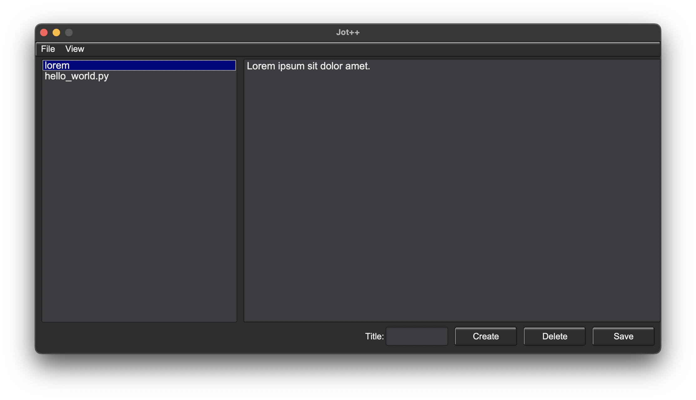

# Jot++

Jot++ is a fast and lightweight note-taking program written in C++.



## Features

- **Fast** note-taking.
- **Lightweight**.
- User-**friendly**.
- **Light** and **dark** mode.

## Requirements
- Compiler: g++
- Build Tool: make
- Dependencies:
    - FLTK 1.4 (libfltk and libfltk_images)
    - SQLite3 (libsqlite3)
### Download requirements
```bash
# Install dependencies on macOS using Homebrew
brew install fltk sqlite

# On Linux (Ubuntu/Debian)
sudo apt install g++ make libfltk1.3-dev libsqlite3-dev

```
## Installation
Install Jot++ by running this codes in your terminal:
```bash
git clone https://github.com/selimozturk13/Jot_Plus_Plus.git
cd Jot_Plus_Plus
make && sudo make install
```
Then, open it by running `jotplusplus` in your terminal or clicking the file into your file manager.

## Usage
Open Jot++. 
### To **create** note
- Write the title of note into the input for title.
- Write the content of note into editor.
- Press to the **create** button.
### To **view** and **edit** a note
- Tap to the note which you want to view and edit.
- The note's content'll appear in the editor, you can edit it.
- When you finish editting, press to the **save** button to save it.
### To **delete a note
- Tap to the note which you want to delete.
- Press **delete** button to delete it.
### To **export notes**
- Tap to the *file* at the menu.
- Tap to the export.
- Select the type. You can export notes as text(.txt) file or markdown(.md) file.
- A your file manager'll open, select the folder that you want to export.
### To change **view** settings
Tap to the *View* at the menu. The settings are at the menu.